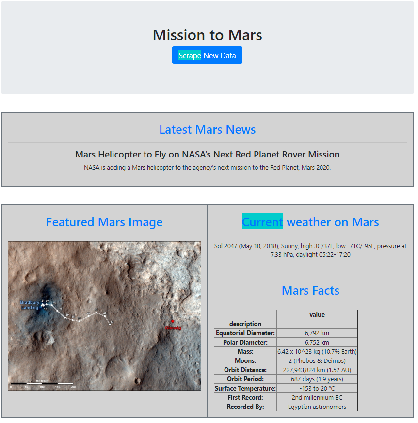
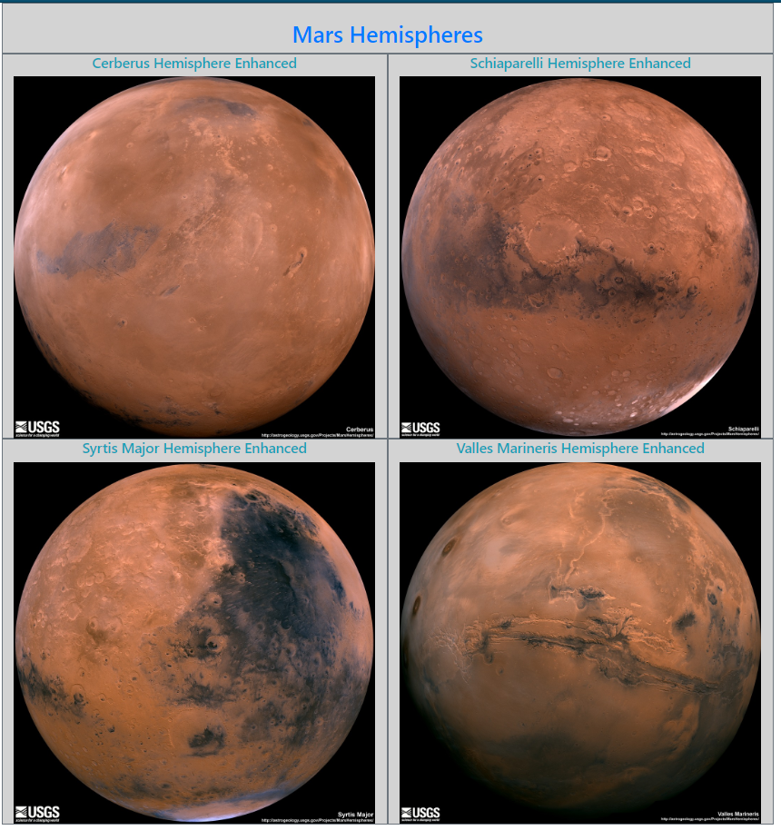

# 13---Web-Scraping-and-Document-Databases


## Step 1 Scraping

This task will use BeautifulSoup,Pandas, and Requests and Splinter to scraping Mars related information 


```python
# Dependencies
from bs4 import BeautifulSoup as bs
import requests
import pandas as pd
from splinter import Browser
import time
```

#### NASA Mars News

We will scrape the lastest News Title and Paragragh Text from NASA Mars News Site(https://mars.nasa.gov/news/).


```python
# URL of page to be scraped
url1 = 'https://mars.nasa.gov/news/?page=0&per_page=40&order=publish_date+desc%2Ccreated_at+desc&search=&category=19%2C165%2C184%2C204&blank_scope=Latest'
# Retrieve page with the requests module
response = requests.get(url1)
```


```python
# Create a Beautiful Soup object
soup1 = bs(response.text, "html5lib")
type(soup1)
```


    bs4.BeautifulSoup


```python
 # Extract the text from the class="content_title" and clean up the text use strip
news_title = soup1.find_all('div', class_='content_title')[0].find('a').text.strip()

#print title to check
print(news_title)
```

    NASA Invests in Visionary Technology
    


```python
 # Extract the paragraph from the class="rollover_description_inner" and clean up the text use strip
news_p = soup1.find_all('div', class_='rollover_description_inner')[0].text.strip()

#print paragraph to check
print(news_p)
```

    NASA is investing in technology concepts, including several from JPL, that may one day be used for future space exploration missions.
    

#### JPL Mars Space Images - Featured Image

Use splinter to navigate the JPL's Featured Space Image and scrape the current Featured Mars Image url (https://www.jpl.nasa.gov/spaceimages/?search=&category=Mars)


```python
# Execute Chromedriver
executable_path = {'executable_path': 'chromedriver.exe'}
browser = Browser('chrome', **executable_path, headless=False)
```


```python
# URL of page to be scraped
url2 = 'https://www.jpl.nasa.gov/spaceimages/?search=&category=Mars'

#Visit the page using the browser
browser.visit(url2)
```


```python
# assign html content
html = browser.html
# Create a Beautiful Soup object
soup2 = bs(html, "html5lib")
```


```python
#Scrape Path for the Feature Image. got the partial path of the url
partial_address = soup2.find_all('a', class_='fancybox')[0].get('data-fancybox-href').strip()
```


```python
#combine the root url to get the full address
featured_image_url = "https://www.jpl.nasa.gov"+partial_address

#Print to check the full URL
print(featured_image_url)

#browse to check url
browser.visit(featured_image_url)
```

    https://www.jpl.nasa.gov/spaceimages/images/mediumsize/PIA00063_ip.jpg
    

#### Mars Weather

Use splinter to scrape the latest Mars weather tweet from the Mars Weather twitter account  (https://twitter.com/marswxreport?lang=en)


```python
# Execute Chromedriver (add in again in case you close the browser)
executable_path = {'executable_path': 'chromedriver.exe'}
browser = Browser('chrome', **executable_path, headless=False)
```


```python
# URL of page to be scraped
url3 = 'https://twitter.com/marswxreport?lang=en'

#Visit the page using the browser
browser.visit(url3)
```


```python
# assign html content
html = browser.html
# Create a Beautiful Soup object
soup3 = bs(html, "html5lib")
```


```python
#scrap latest Mars weather tweet
mars_weather = soup3.find_all('p', class_='TweetTextSize TweetTextSize--normal js-tweet-text tweet-text')[0].text

#print to check tweet
print(mars_weather)
```

    #InSight rising above the California fog on liftoff.https://twitter.com/birdsnspace/status/993603886106660864 …
    

#### Mars Facts

Use Pandas to scrape the table from Mars Facts webpage and convert the data to a HTML table string


```python
# URL of page to be scraped
url4 = 'https://space-facts.com/mars/'
```


```python
# use Pandas to get the url table
tables = pd.read_html(url4)
tables
```


    [                      0                              1
     0  Equatorial Diameter:                       6,792 km
     1       Polar Diameter:                       6,752 km
     2                 Mass:  6.42 x 10^23 kg (10.7% Earth)
     3                Moons:            2 (Phobos & Deimos)
     4       Orbit Distance:       227,943,824 km (1.52 AU)
     5         Orbit Period:           687 days (1.9 years)
     6  Surface Temperature:                  -153 to 20 °C
     7         First Record:              2nd millennium BC
     8          Recorded By:           Egyptian astronomers]


```python
# Convert list of table into pandas dataframe
df = tables[0]

# update column name
df.columns=['description','value']

# inspect dataframe
df
```


<div>
<style>
    .dataframe thead tr:only-child th {
        text-align: right;
    }

    .dataframe thead th {
        text-align: left;
    }

    .dataframe tbody tr th {
        vertical-align: top;
    }
</style>
<table border="1" class="dataframe">
  <thead>
    <tr style="text-align: right;">
      <th></th>
      <th>description</th>
      <th>value</th>
    </tr>
  </thead>
  <tbody>
    <tr>
      <th>0</th>
      <td>Equatorial Diameter:</td>
      <td>6,792 km</td>
    </tr>
    <tr>
      <th>1</th>
      <td>Polar Diameter:</td>
      <td>6,752 km</td>
    </tr>
    <tr>
      <th>2</th>
      <td>Mass:</td>
      <td>6.42 x 10^23 kg (10.7% Earth)</td>
    </tr>
    <tr>
      <th>3</th>
      <td>Moons:</td>
      <td>2 (Phobos &amp; Deimos)</td>
    </tr>
    <tr>
      <th>4</th>
      <td>Orbit Distance:</td>
      <td>227,943,824 km (1.52 AU)</td>
    </tr>
    <tr>
      <th>5</th>
      <td>Orbit Period:</td>
      <td>687 days (1.9 years)</td>
    </tr>
    <tr>
      <th>6</th>
      <td>Surface Temperature:</td>
      <td>-153 to 20 °C</td>
    </tr>
    <tr>
      <th>7</th>
      <td>First Record:</td>
      <td>2nd millennium BC</td>
    </tr>
    <tr>
      <th>8</th>
      <td>Recorded By:</td>
      <td>Egyptian astronomers</td>
    </tr>
  </tbody>
</table>
</div>


```python
#Set the index to the description column

df.set_index('description', inplace=True)
df
```


<div>
<style>
    .dataframe thead tr:only-child th {
        text-align: right;
    }

    .dataframe thead th {
        text-align: left;
    }

    .dataframe tbody tr th {
        vertical-align: top;
    }
</style>
<table border="1" class="dataframe">
  <thead>
    <tr style="text-align: right;">
      <th></th>
      <th>value</th>
    </tr>
    <tr>
      <th>description</th>
      <th></th>
    </tr>
  </thead>
  <tbody>
    <tr>
      <th>Equatorial Diameter:</th>
      <td>6,792 km</td>
    </tr>
    <tr>
      <th>Polar Diameter:</th>
      <td>6,752 km</td>
    </tr>
    <tr>
      <th>Mass:</th>
      <td>6.42 x 10^23 kg (10.7% Earth)</td>
    </tr>
    <tr>
      <th>Moons:</th>
      <td>2 (Phobos &amp; Deimos)</td>
    </tr>
    <tr>
      <th>Orbit Distance:</th>
      <td>227,943,824 km (1.52 AU)</td>
    </tr>
    <tr>
      <th>Orbit Period:</th>
      <td>687 days (1.9 years)</td>
    </tr>
    <tr>
      <th>Surface Temperature:</th>
      <td>-153 to 20 °C</td>
    </tr>
    <tr>
      <th>First Record:</th>
      <td>2nd millennium BC</td>
    </tr>
    <tr>
      <th>Recorded By:</th>
      <td>Egyptian astronomers</td>
    </tr>
  </tbody>
</table>
</div>


```python
# Use pandas to  generate HTML tables from DataFrames and save as html file
df.to_html('table.html')

```

#### Mars Hemisperes

USGS Astrogeology site to obtain high resolution images for each of Mar's hemispheres


```python
# Execute Chromedriver (add in again in case you close the browser)
executable_path = {'executable_path': 'chromedriver.exe'}
browser = Browser('chrome', **executable_path, headless=False)
```


```python
# URL of page to be scraped
url5 = 'https://astrogeology.usgs.gov/search/results?q=hemisphere+enhanced&k1=target&v1=Mars'

#Visit the page using the browser
browser.visit(url5)
```


```python
# assign html content
html = browser.html
# Create a Beautiful Soup object
soup5 = bs(html,"html5lib")
```


```python
# assigned list to store:
hemisphere_image_urls = []
```


```python
# create empty dict
dict = {}
```


```python
# get all the title
results = soup5.find_all('h3')
```


```python
# Loop through each result
for result in results:
    # Get text info from result
    itema = result.text
    time.sleep(1)    
    browser.click_link_by_partial_text(itema)
    time.sleep(1)
    # assign html content
    htmla = browser.html
    # Create a Beautiful Soup object
    soupa = bs(htmla,"html5lib")
    time.sleep(1)
    # Grab the image link
    linka = soupa.find_all('div', class_="downloads")[0].find_all('a')[0].get("href")
        # Pass title to Dict
    time.sleep(1)
    dict["title"]=itema
    # Pass url to Dict
    dict["img_url"]=linka
    # Append Dict to the list 
    hemisphere_image_urls.append(dict)
    # Clean Up Dict
    dict = {}
    browser.click_link_by_partial_text('Back')
    time.sleep(1)
```


```python
# review List
hemisphere_image_urls
```


    [{'img_url': 'http://astropedia.astrogeology.usgs.gov/download/Mars/Viking/cerberus_enhanced.tif/full.jpg',
      'title': 'Cerberus Hemisphere Enhanced'},
     {'img_url': 'http://astropedia.astrogeology.usgs.gov/download/Mars/Viking/schiaparelli_enhanced.tif/full.jpg',
      'title': 'Schiaparelli Hemisphere Enhanced'},
     {'img_url': 'http://astropedia.astrogeology.usgs.gov/download/Mars/Viking/syrtis_major_enhanced.tif/full.jpg',
      'title': 'Syrtis Major Hemisphere Enhanced'},
     {'img_url': 'http://astropedia.astrogeology.usgs.gov/download/Mars/Viking/valles_marineris_enhanced.tif/full.jpg',
      'title': 'Valles Marineris Hemisphere Enhanced'}]

## Step 2 - MongoDB and Flask Application

The next step is to use MongoDB and Flask templating to create a new HTML page that displays all of the information that was scraped from the URLs above.

---

### a. Setup

You will require the following in order to successfully run the python script:
1. Download MongoDB
2. Set up MongoDb: Before run the script. To activate the MongoDB, please open "Command Prompt" and type:
```bash
$ mongod
```
3. Please make sure you have the following requirements:
 * flask
 * Flask-Pymongo
 * pandas
 * splinter
 
---

### b. Process

To run the script, please follow the following step:
1. Please download/clone the repository into your desktop
2. Go to the repository in your desktop, then use command prompt to run the "app.py" file by typing:
```bash
$ python app.py
```
3. The command prompt will pop up your local http route
4. Please copy the http route and use explorer, chrome or other browser to open the link
5. The python on the backgroup will pull the "index.html" in the template folder to create the web page
6. Once the webpage shows up, click on the button "Scrape New Data"
7. The python code on the back end will call the "scrape()" function in the "scrape_mars.py" to scrape all the Mars information and to store them into MongoDB
8. The website template and the app.py file have been coded to call the data stored in the MongoDB and display it on the webpage.

---
### c. Solution
1. scrape_mars.py (used to be called as a function to store data):
```python
# Scrape Web Data about Mars and Return one Library to collect all the scrape data
# Dependencies
from bs4 import BeautifulSoup as bs
import requests
import pandas as pd
from splinter import Browser
from splinter.exceptions import ElementDoesNotExist
import time


# Define scrape function
def scrape():
    # Create a library that holds all the Mars' Data
    mars_library = {}
    # Use splinter to navigate the JPL's Featured Space Image and scrape the current Featured Mars Image url (https://www.jpl.nasa.gov/spaceimages/?search=&category=Mars)
    # Execute Chromedriver
    executable_path = {'executable_path': 'chromedriver.exe'}
    browser = Browser('chrome', **executable_path, headless=False)
    # #### NASA Mars News
    # We will scrape the lastest News Title and Paragragh Text from NASA Mars News Site(https://mars.nasa.gov/news/).
    # URL of page to be scraped
    url1 = 'https://mars.nasa.gov/news/?page=0&per_page=40&order=publish_date+desc%2Ccreated_at+desc&search=&category=19%2C165%2C184%2C204&blank_scope=Latest'
    #Visit the page using the browser
    browser.visit(url1)
    # assign html content
    html = browser.html
    # Create a Beautiful Soup object
    soup1 = bs(html, "html5lib")
    # Extract the text from the class="content_title" and clean up the text use strip
    news_title = soup1.find_all('div', class_='content_title')[0].find('a').text.strip()
    # Extract the paragraph from the class="rollover_description_inner" and clean up the text use strip
    news_p = soup1.find_all('div', class_='rollover_description_inner')[0].text.strip()
    # put infos into Library
    mars_library['news_title'] = news_title
    mars_library['news_p'] = news_p


    # #### JPL Mars Space Images - Featured Image
    # URL of page to be scraped
    url2 = 'https://www.jpl.nasa.gov/spaceimages/?search=&category=Mars'
    #Visit the page using the browser
    browser.visit(url2)
    # assign html content
    html = browser.html
    # Create a Beautiful Soup object
    soup2 = bs(html, "html5lib")
    #Scrape Path for the Feature Image. got the partial path of the url
    partial_address = soup2.find_all('a', class_='fancybox')[0].get('data-fancybox-href').strip()
    #combine the root url to get the full address
    featured_image_url = "https://www.jpl.nasa.gov"+partial_address
    # Put infos into Library
    mars_library['featured_image_url'] = featured_image_url


    # #### Mars Weather
    # Use splinter to scrape the latest Mars weather tweet from the Mars Weather twitter account  (https://twitter.com/marswxreport?lang=en)
    # URL of page to be scraped
    url3 = 'https://twitter.com/marswxreport?lang=en'
    #Visit the page using the browser
    browser.visit(url3)
    # assign html content
    html = browser.html
    # Create a Beautiful Soup object
    soup3 = bs(html, "html5lib")
    #scrap latest Mars weather tweet
    mars_weather = soup3.find_all('p', class_='TweetTextSize TweetTextSize--normal js-tweet-text tweet-text')[0].text
    # Put infos into Library
    mars_library['mars_weather'] = mars_weather


    # #### Mars Facts
    # Use Pandas to scrape the table from Mars Facts webpage and convert the data to a HTML table string
    # URL of page to be scraped
    url4 = 'https://space-facts.com/mars/'
    # use Pandas to get the url table
    tables = pd.read_html(url4)
    # Convert list of table into pandas dataframe
    df = tables[0]
    # update column name
    df.columns=['description','value']
    #Set the index to the description column
    df.set_index('description', inplace=True)
    # Use pandas to  generate HTML tables from DataFrames and save as html file
    mars_facts=df.to_html(justify='left')
    # Put infos into Library
    mars_library['mars_facts'] = mars_facts


    # #### Mars Hemisperes
    # USGS Astrogeology site to obtain high resolution images for each of Mar's hemispheres
    # URL of page to be scraped
    url5 = 'https://astrogeology.usgs.gov/search/results?q=hemisphere+enhanced&k1=target&v1=Mars'
    #Visit the page using the browser
    browser.visit(url5)
    # assign html content
    html = browser.html
    # Create a Beautiful Soup object
    soup5 = bs(html,"html5lib")
    # assigned list to store:
    hemisphere_image_urls = []
    # create empty dict
    dict = {}
    # get all the title
    results = soup5.find_all('h3')
    # Loop through each result
    for result in results:
        # Get text info from result
        itema = result.text
        time.sleep(1)    
        browser.click_link_by_partial_text(itema)
        time.sleep(1)
        # assign html content
        htmla = browser.html
        # Create a Beautiful Soup object
        soupa = bs(htmla,"html5lib")
        time.sleep(1)
        # Grab the image link
        linka = soupa.find_all('div', class_="downloads")[0].find_all('a')[0].get("href")
            # Pass title to Dict
        time.sleep(1)
        dict["title"]=itema
        # Pass url to Dict
        dict["img_url"]=linka
        # Append Dict to the list 
        hemisphere_image_urls.append(dict)
        # Clean Up Dict
        dict = {}
        browser.click_link_by_partial_text('Back')
        time.sleep(1)
    # Put infos into Library
    mars_library['hemisphere_image_urls']=hemisphere_image_urls
    
    # Return Library
    return mars_library
```
---
2. index.html (used as a templated to display the webpage):
```html
<!DOCTYPE html>
<html lang="en">

<head>
  <meta charset="UTF-8">
  <meta name="viewport" content="width=device-width, initial-scale=1, shrink-to-fit=no">
  <meta http-equiv="X-UA-Compatible" content="ie=edge">
  <title>Get Mars Data</title>
  <!-- Bootstrap CSS -->
  <link rel="stylesheet" href="https://stackpath.bootstrapcdn.com/bootstrap/4.1.1/css/bootstrap.min.css">
</head>

<body>
  <div class="container text-center">
  	<div class="jumbotron text-center ml-5 mt-5 mr-5 mb-5">
    	<h1>Mission to Mars</h1>
        <p><a class="btn btn-primary btn-lg" href="/scrape" role="button">Scrape New Data</a></p>
    </div>
  </div>

  <div class="container text-center">
	<div class="row ml-5 mt-5 mr-5 mb-5">
	  <div class="col-lg-12 mb-6  border border-secondary" style="background-color:lightgrey;">
	    <div class="thumbnail">
	      <h2 class="text-primary pt-4">Latest Mars News</h2>
	      <hr>
	      <h4>{{mars.news_title}}</h4>
	      <p>{{mars.news_p}}</p>
	      <br>
	    </div>
	  </div>
	</div>
  </div>
      
  <div class="container text-center">	
    <div class="row text-center ml-5 mt-5 mr-5 mb-5">
      <div class="col-lg-6 mb-6  border border-secondary" style="background-color:lightgrey;">
        <h2 class="text-primary pt-4">Featured Mars Image</h2>
        <hr>
		<a href={{mars.featured_image_url}}>
          </a>
      </div>
      <hr>
      <br>
      <div class="col-lg-6 mb-6 border border-secondary" style="background-color:lightgrey;">
       	<h2 class="text-primary pt-4">Current weather on Mars</h2>
        <hr>
		<p>{{mars.mars_weather}}</p>
		<br>
        <div>
          <h2 class="text-primary pt-4">Mars Facts</h2>
          <hr>
          <table class="table table-sm table-striped table-bordered table-responsive-lg">
          	{{mars.mars_facts}}
          </table>
        </div>
      </div>        
    </div>
  </div>
  <hr>
  <p></p>
  <br>
  <div class="container text-center">
	<div class="row ml-5 mt-5 mr-5 mb-5">
      <div class="col-md-12 border border-secondary" style="background-color:lightgrey;">
      	<h2 class="text-primary pt-4 text-center">Mars Hemispheres</h2>
      </div>
         
      <div class="col-md-6 border border-secondary" style="background-color:lightgrey;">
        <h5 class="text-info">{{item.title}}</h5>
        <a href={{item.img_url}}>
          
        </a>
      </div>
        
      </div>
      <hr>
    </div>
  </div>
</body>

</html>
```
---
3. app.py (used to call in the webpage template and scrape data function and generate the webpage:
```python
from flask import Flask, render_template, jsonify, redirect
from flask_pymongo import PyMongo
import scrape_mars

app = Flask(__name__)

mongo = PyMongo(app)


@app.route("/")
def index():
    mars = mongo.db.mars.find_one()
    return render_template("index.html", mars=mars)

# Scrape Data and pull into Mongo DB
@app.route('/scrape')
def get():
    mars = mongo.db.mars
    marsdata = scrape_mars.scrape()
    mars.update({}, marsdata, upsert=True)
    return redirect("/", code=302)


if __name__ == "__main__":
    app.run()
```
---
### 4. End Product Showcase
The screenshot below is the end product once you successfully scrape the relevant data:



